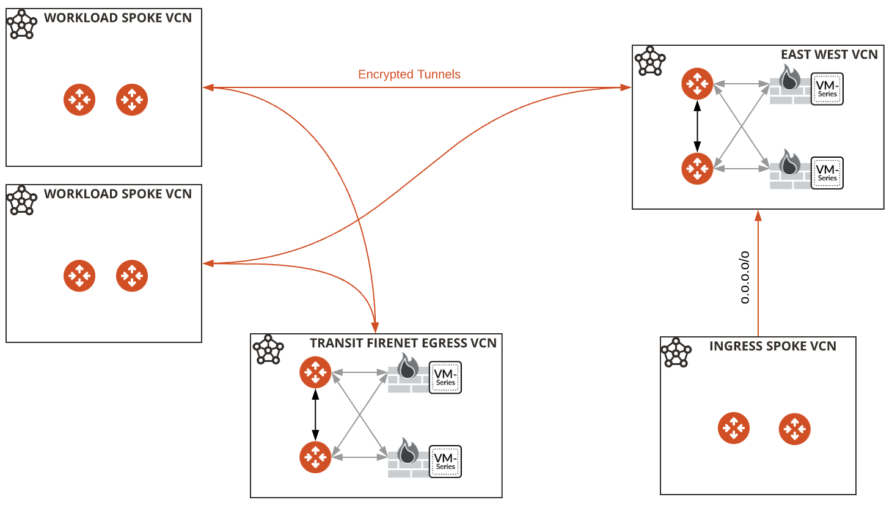

# OCI Dual FireNet Bespoke with sgm config (us-phoenix-1)

##  Advanced **_customized_** example demonstrating the use of multiple Transit FireNet and an Ingress Spoke

- Built with https://registry.terraform.io/modules/terraform-aviatrix-modules/oci-transit-firenet/aviatrix/latest
- Spoke module from TF registry local to this repo customized to account for multiple attachments (eastwest & egress)
- Drive it by variables as needed
- Set TF_VARs for username, controller_ip, password in your env
- This repository is customized **_specifically for OCI us-phoenix-1_** deployment
- This repository uses the ```aviatrix_controller_config``` to enable security group management
  

### Infrastructure diagram



### Compatibility
Terraform version | Controller version | Terraform provider version
:--- | :--- | :---
0.13,0.14,0.15 | 6.4.2672 | 2.19.3


### Variables

The variables are defined in ```terraform.tfvars```.

**Note:** 

Runtime - ~1h, monitor through OCI Console & Aviatrix Controller

```ha_enabled = false``` controls whether ha is built gateways and firewall instances - this is set to false by default to minimize provisioning time for MVP

```instance_size``` controls the size of all the transit spokes and gateways. 

```firewall_size``` controls the size of the PAN instances

```insane_mode``` controls whether insane mode encryption (HPE) is enabled in transit and spokes

### Prerequisites

- Software version requirements met
- Aviatrix Controller with Access Account in OCI
- Sufficient limits in place for OCI region in scope **_(Compute quotas, etc.)_**
- terraform .13 in the user environment ```terraform -v``` 

### Workflow

- Modify ```terraform.tfvars``` _(i.e. access account name, regions, cidrs, etc.)_ and save the file.
- ```terraform init```
- ```terraform plan```
- ```terraform apply --auto-approve```

### Terraform state (post-provisioning)

```
$ terraform state list
aviatrix_controller_config.sgm_config
aviatrix_spoke_transit_attachment.egress_attach_wl1
aviatrix_spoke_transit_attachment.ew_attach_wl1
aviatrix_spoke_transit_attachment.ingress_attach
module.oci_ingress_spoke.aviatrix_spoke_gateway.default
module.oci_ingress_spoke.aviatrix_vpc.default
module.oci_transit_firenet_1.aviatrix_firenet.firenet
module.oci_transit_firenet_1.aviatrix_firewall_instance.firewall_instance_1[0]
module.oci_transit_firenet_1.aviatrix_firewall_instance.firewall_instance_2[0]
module.oci_transit_firenet_1.aviatrix_firewall_instance_association.firenet_instance1[0]
module.oci_transit_firenet_1.aviatrix_firewall_instance_association.firenet_instance2[0]
module.oci_transit_firenet_1.aviatrix_transit_gateway.default
module.oci_transit_firenet_1.aviatrix_vpc.default
module.oci_transit_firenet_2.aviatrix_firenet.firenet
module.oci_transit_firenet_2.aviatrix_firewall_instance.firewall_instance_1[0]
module.oci_transit_firenet_2.aviatrix_firewall_instance.firewall_instance_2[0]
module.oci_transit_firenet_2.aviatrix_firewall_instance_association.firenet_instance1[0]
module.oci_transit_firenet_2.aviatrix_firewall_instance_association.firenet_instance2[0]
module.oci_transit_firenet_2.aviatrix_transit_gateway.default
module.oci_transit_firenet_2.aviatrix_vpc.default
module.oci_workload_spoke_1.aviatrix_spoke_gateway.default
module.oci_workload_spoke_1.aviatrix_vpc.default
```
